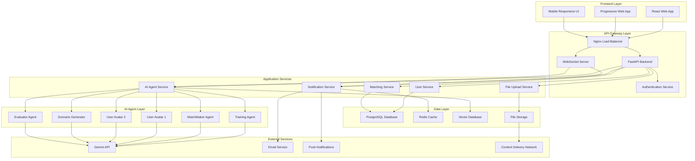

# Design Document: AI Matchmaker Web Platform

## Overview

The AI Matchmaker Web Platform is a modern, social matchmaking application that combines AI-powered personality assessment with real-time agent interactions. Users create profiles, complete interactive personality assessments, and watch their AI avatars engage with potential matches through live conversations and relationship simulations. The platform provides a comprehensive social experience with match discovery, compatibility dashboards, and detailed relationship insights.

The system uses a modern web architecture with React frontend, FastAPI backend, PostgreSQL database, and real-time WebSocket communications. AI agents are powered by Google's Gemini API and AgentScope framework, with Mem0 providing advanced memory management for personality data. The platform supports multi-language localization and cultural adaptation for global users.

## Architecture

### System Architecture Diagram



### Component Architecture

The system follows a modern microservices architecture optimized for web applications:

1. **Frontend Layer**: React-based single-page application with PWA capabilities
2. **API Gateway Layer**: FastAPI backend with WebSocket support for real-time features
3. **Application Services**: Microservices for user management, matching, AI coordination
4. **AI Agent Layer**: Specialized AI agents for personality assessment and matchmaking
5. **Data Layer**: PostgreSQL for relational data, Vector DB for AI embeddings, Redis for caching
6. **External Services**: Third-party integrations for AI, notifications, and content delivery

## Components and Interfaces

### Frontend Components

#### React Application Structure
```typescript
// Main App Component
interface AppProps {
  user: User | null;
  theme: 'light' | 'dark';
}

const App: React.FC<AppProps> = ({ user, theme }) => {
  return (
    <Router>
      <Routes>
        <Route path="/" element={<LandingPage />} />
        <Route path="/auth" element={<AuthPage />} />
        <Route path="/onboarding" element={<PersonalityAssessment />} />
        <Route path="/dashboard" element={<UserDashboard />} />
        <Route path="/discover" element={<MatchDiscovery />} />
        <Route path="/theater/:sessionId" element={<LiveMatchingTheater />} />
        <Route path="/compatibility/:matchId" element={<CompatibilityReport />} />
        <Route path="/profile" element={<UserProfile />} />
      </Routes>
    </Router>
  );
};
```

#### Key Frontend Components

##### PersonalityAssessment
```typescript
interface PersonalityAssessmentProps {
  onComplete: (profile: PersonalityProfile) => void;
  currentStep: number;
  totalSteps: number;
}

const PersonalityAssessment: React.FC<PersonalityAssessmentProps> = ({
  onComplete,
  currentStep,
  totalSteps
}) => {
  // Interactive questionnaire with progress tracking
  // Dynamic question adaptation based on responses
  // Real-time personality insights preview
  // Engaging UI with animations and feedback
};
```

##### LiveMatchingTheater
```typescript
interface LiveMatchingTheaterProps {
  sessionId: string;
  userAvatar: UserAvatar;
  matchAvatar: UserAvatar;
}

const LiveMatchingTheater: React.FC<LiveMatchingTheaterProps> = ({
  sessionId,
  userAvatar,
  matchAvatar
}) => {
  // Real-time conversation display
  // Avatar animations and expressions
  // User interaction controls (guidance, feedback)
  // Compatibility metrics live updates
  // WebSocket connection for real-time updates
};
```

##### CompatibilityDashboard
```typescript
interface CompatibilityDashboardProps {
  matchId: string;
  compatibilityData: CompatibilityReport;
  interactionHistory: ConversationSession[];
}

const CompatibilityDashboard: React.FC<CompatibilityDashboardProps> = ({
  matchId,
  compatibilityData,
  interactionHistory
}) => {
  // Interactive compatibility charts
  // Detailed analysis breakdowns
  // Conversation highlights and insights
  // Actionable recommendations
  // Social sharing capabilities
};
```

### Backend API Services

#### User Service
```python
class UserService:
    """
    Manages user accounts, profiles, and authentication.
    Handles user registration, login, profile updates, and preferences.
    """
    
    async def create_user(self, user_data: UserRegistration) -> User:
        # Create new user account with email verification
        # Initialize empty personality profile
        # Set up default preferences and privacy settings
    
    async def authenticate_user(self, credentials: LoginCredentials) -> AuthToken:
        # Validate user credentials
        # Generate JWT tokens for session management
        # Update last login and activity tracking
    
    async def update_profile(self, user_id: str, profile_data: ProfileUpdate) -> User:
        # Update user profile information
        # Trigger AI avatar retraining if personality data changed
        # Notify matching service of profile updates
    
    async def get_user_dashboard(self, user_id: str) -> DashboardData:
        # Aggregate user's matches, conversations, and reports
        # Calculate profile completeness and suggestions
        # Return personalized dashboard content
```

#### Matching Service
```python
class MatchingService:
    """
    Handles match discovery, compatibility calculation, and match management.
    Coordinates with AI agents for personality-based matching.
    """
    
    async def discover_matches(self, user_id: str, filters: MatchFilters) -> List[PotentialMatch]:
        # Apply user preferences and filters
        # Calculate personality compatibility scores
        # Return ranked list of potential matches
    
    async def create_match_session(self, user1_id: str, user2_id: str) -> MatchSession:
        # Initialize AI avatars for both users
        # Create live conversation environment
        # Set up WebSocket channels for real-time updates
    
    async def process_user_interaction(self, session_id: str, interaction: UserInteraction):
        # Handle user likes, passes, and feedback
        # Update match status and notifications
        # Trigger compatibility analysis if mutual interest
```

#### AI Agent Service
```python
class AIAgentService:
    """
    Coordinates AI agents for personality assessment and matchmaking.
    Manages agent lifecycle and conversation orchestration.
    """
    
    async def create_user_avatar(self, user_id: str, personality_data: PersonalityProfile) -> UserAvatar:
        # Initialize AI avatar with personality traits
        # Configure response patterns and communication style
        # Set up memory integration for contextual responses
    
    async def start_live_conversation(self, session_id: str, participants: List[UserAvatar]) -> ConversationManager:
        # Create conversation environment with WebSocket broadcasting
        # Initialize MatchMaker agent for conversation facilitation
        # Set up real-time updates for frontend theater
    
    async def run_scenario_simulation(self, session_id: str, scenario: Scenario) -> SimulationResult:
        # Present scenario to AI avatars
        # Facilitate scenario-based interactions
        # Analyze responses for compatibility insights
```

### Real-time Communication

#### WebSocket Manager
```python
class WebSocketManager:
    """
    Manages real-time communication for live AI conversations.
    Handles WebSocket connections and message broadcasting.
    """
    
    async def connect_user_to_session(self, user_id: str, session_id: str, websocket: WebSocket):
        # Establish WebSocket connection for user
        # Join user to conversation room
        # Send initial session state and history
    
    async def broadcast_conversation_update(self, session_id: str, message: ConversationMessage):
        # Send real-time message to all connected users
        # Update conversation state in database
        # Trigger compatibility analysis updates
    
    async def send_compatibility_update(self, session_id: str, compatibility_data: CompatibilityUpdate):
        # Broadcast live compatibility scores
        # Send interaction insights and highlights
        # Update user dashboards in real-time
```

### Database Models

#### User and Profile Models
```python
class User(BaseModel):
    """Complete user account model for the web platform."""
    
    id: str = Field(primary_key=True)
    email: str = Field(unique=True, index=True)
    username: str = Field(unique=True, index=True)
    password_hash: str
    is_verified: bool = False
    is_active: bool = True
    
    # Profile information
    first_name: str
    last_name: str
    date_of_birth: date
    gender: str
    location: str
    bio: Optional[str] = None
    
    # Platform settings
    privacy_settings: Dict[str, Any] = Field(default_factory=dict)
    notification_preferences: Dict[str, bool] = Field(default_factory=dict)
    subscription_tier: str = "free"
    
    # Timestamps
    created_at: datetime = Field(default_factory=datetime.utcnow)
    updated_at: datetime = Field(default_factory=datetime.utcnow)
    last_active: Optional[datetime] = None

class UserPhoto(BaseModel):
    """User photo model for profile images."""
    
    id: str = Field(primary_key=True)
    user_id: str = Field(foreign_key="user.id")
    file_url: str
    is_primary: bool = False
    order_index: int = 0
    uploaded_at: datetime = Field(default_factory=datetime.utcnow)

class Match(BaseModel):
    """Match relationship between two users."""
    
    id: str = Field(primary_key=True)
    user1_id: str = Field(foreign_key="user.id")
    user2_id: str = Field(foreign_key="user.id")
    
    # Match status
    status: MatchStatus  # PENDING, MUTUAL, EXPIRED, BLOCKED
    user1_interest: InterestLevel  # LIKE, PASS, SUPER_LIKE
    user2_interest: Optional[InterestLevel] = None
    
    # Compatibility data
    compatibility_score: Optional[float] = None
    compatibility_report_id: Optional[str] = None
    
    # Interaction tracking
    conversation_count: int = 0
    simulation_count: int = 0
    last_interaction: Optional[datetime] = None
    
    created_at: datetime = Field(default_factory=datetime.utcnow)
    updated_at: datetime = Field(default_factory=datetime.utcnow)
```

### Frontend Technology Stack

#### React Application
- **Framework**: React 18 with TypeScript
- **State Management**: Redux Toolkit + RTK Query
- **Routing**: React Router v6
- **UI Components**: Material-UI (MUI) or Chakra UI
- **Real-time**: Socket.IO client for WebSocket connections
- **Charts**: Recharts or Chart.js for compatibility visualizations
- **Animations**: Framer Motion for smooth UI transitions
- **PWA**: Workbox for progressive web app features

#### Backend Technology Stack
- **Framework**: FastAPI with Python 3.11+
- **Database**: PostgreSQL 15+ with SQLAlchemy ORM
- **Caching**: Redis for session management and real-time data
- **Vector DB**: ChromaDB or Pinecone for AI embeddings
- **Authentication**: JWT tokens with refresh token rotation
- **File Storage**: AWS S3 or Google Cloud Storage for user photos
- **WebSockets**: FastAPI WebSocket support with Socket.IO
- **Background Tasks**: Celery with Redis broker

## Data Models

### Enhanced Web Platform Models

#### User Profile Schema
```python
class UserProfile(BaseModel):
    """Enhanced user profile for web platform."""
    
    # Basic Information
    user_id: str
    email: str
    username: str
    first_name: str
    last_name: str
    date_of_birth: date
    gender: str
    location: LocationData
    bio: Optional[str] = None
    
    # Photos and Media
    photos: List[UserPhoto] = Field(default_factory=list)
    primary_photo_url: Optional[str] = None
    
    # Personality and Preferences
    personality_profile: Optional[PersonalityProfile] = None
    dating_preferences: DatingPreferences
    
    # Platform Data
    verification_status: VerificationStatus
    subscription_tier: SubscriptionTier
    privacy_settings: PrivacySettings
    
    # Activity Tracking
    profile_completeness: float = 0.0
    last_active: datetime
    join_date: datetime
    total_matches: int = 0
    successful_matches: int = 0

class DatingPreferences(BaseModel):
    """User's dating and matching preferences."""
    
    age_range: Tuple[int, int]
    max_distance: int  # in kilometers
    gender_preference: List[str]
    relationship_goals: List[str]
    lifestyle_preferences: Dict[str, Any]
    deal_breakers: List[str]
    importance_weights: Dict[str, float]  # Weight different compatibility factors

class MatchSession(BaseModel):
    """Live matching session between two users."""
    
    session_id: str
    user1_id: str
    user2_id: str
    session_type: SessionType  # CONVERSATION, SIMULATION, SPEED_CHAT
    
    # Session State
    status: SessionStatus  # WAITING, ACTIVE, COMPLETED, TERMINATED
    start_time: datetime
    end_time: Optional[datetime] = None
    
    # AI Agents
    user1_avatar: UserAvatar
    user2_avatar: UserAvatar
    matchmaker_agent: MatchMakerAgent
    
    # Real-time Data
    messages: List[ConversationMessage] = Field(default_factory=list)
    live_compatibility_score: float = 0.0
    viewer_count: int = 0
    
    # Results
    final_compatibility_report: Optional[CompatibilityReport] = None
    user_feedback: Dict[str, UserFeedback] = Field(default_factory=dict)

class ConversationMessage(BaseModel):
    """Real-time conversation message for web display."""
    
    message_id: str
    session_id: str
    sender_type: AgentType  # USER_AVATAR, MATCHMAKER_AGENT, SYSTEM
    sender_name: str
    content: str
    timestamp: datetime
    
    # Web-specific fields
    message_type: MessageType  # TEXT, EMOTION, ACTION, SYSTEM_NOTIFICATION
    emotion_indicators: List[str] = Field(default_factory=list)
    compatibility_impact: Optional[float] = None
    is_highlighted: bool = False  # For important compatibility moments
```

### API Response Models

#### Match Discovery Response
```python
class MatchDiscoveryResponse(BaseModel):
    """Response for match discovery API."""
    
    matches: List[PotentialMatch]
    total_count: int
    has_more: bool
    filters_applied: MatchFilters
    recommendations: List[str]  # Personalized suggestions

class PotentialMatch(BaseModel):
    """Potential match data for discovery interface."""
    
    user_id: str
    display_name: str
    age: int
    location: str
    primary_photo_url: str
    bio_preview: str  # First 100 characters
    
    # Compatibility Preview
    compatibility_preview: float  # Quick compatibility estimate
    shared_interests: List[str]
    personality_highlights: List[str]
    
    # Interaction Data
    mutual_connections: int
    last_active: str  # Human-readable format
    is_online: bool
    response_rate: float  # How often they respond to matches

class LiveSessionUpdate(BaseModel):
    """Real-time update for live matching sessions."""
    
    session_id: str
    update_type: UpdateType  # MESSAGE, COMPATIBILITY, STATUS, USER_JOIN
    timestamp: datetime
    
    # Update Data
    message: Optional[ConversationMessage] = None
    compatibility_update: Optional[CompatibilityUpdate] = None
    status_change: Optional[SessionStatus] = None
    user_action: Optional[UserAction] = None

class CompatibilityUpdate(BaseModel):
    """Real-time compatibility score updates."""
    
    overall_score: float
    dimension_scores: Dict[str, float]
    trending_direction: str  # "improving", "declining", "stable"
    key_insights: List[str]
    conversation_highlights: List[ConversationHighlight]
```

## Error Handling

### Web-Specific Error Management

#### API Error Responses
```python
class APIError(BaseModel):
    """Standardized API error response."""
    
    error_code: str
    message: str
    details: Optional[Dict[str, Any]] = None
    timestamp: datetime = Field(default_factory=datetime.utcnow)
    request_id: str

class ValidationError(APIError):
    """Form validation errors for frontend."""
    
    field_errors: Dict[str, List[str]]
    form_errors: List[str] = Field(default_factory=list)

class AuthenticationError(APIError):
    """Authentication and authorization errors."""
    
    error_type: str  # "invalid_credentials", "token_expired", "insufficient_permissions"
    redirect_url: Optional[str] = None
```

#### Frontend Error Handling
```typescript
interface ErrorBoundaryState {
  hasError: boolean;
  error: Error | null;
  errorInfo: ErrorInfo | null;
}

class AppErrorBoundary extends React.Component<Props, ErrorBoundaryState> {
  // Global error boundary for React application
  // Graceful error display and reporting
  // Automatic error recovery mechanisms
}

// API Error Handling
const apiErrorHandler = (error: APIError) => {
  switch (error.error_code) {
    case 'AUTHENTICATION_REQUIRED':
      // Redirect to login
      break;
    case 'PROFILE_INCOMPLETE':
      // Redirect to onboarding
      break;
    case 'WEBSOCKET_CONNECTION_FAILED':
      // Show connection retry UI
      break;
    default:
      // Show generic error message
  }
};
```

## Testing Strategy

### Web Application Testing

#### Frontend Testing
- **Unit Tests**: Jest + React Testing Library for component testing
- **Integration Tests**: Cypress for end-to-end user workflows
- **Visual Tests**: Storybook + Chromatic for UI component testing
- **Performance Tests**: Lighthouse CI for web performance monitoring
- **Accessibility Tests**: axe-core for WCAG compliance testing

#### Backend Testing
- **Unit Tests**: pytest for API endpoint and service testing
- **Integration Tests**: TestClient for full API workflow testing
- **Load Tests**: Locust for performance and scalability testing
- **Security Tests**: OWASP ZAP for security vulnerability scanning

#### Real-time Testing
- **WebSocket Tests**: Custom test framework for real-time communication
- **AI Agent Tests**: Mock AI responses for consistent testing
- **Compatibility Tests**: Property-based testing for matching algorithms

### Testing Configuration

```python
# Backend Test Configuration
@pytest.fixture
async def test_client():
    """Test client for API testing."""
    async with AsyncClient(app=app, base_url="http://test") as client:
        yield client

@pytest.fixture
async def authenticated_user():
    """Authenticated user for protected endpoint testing."""
    user = await create_test_user()
    token = generate_jwt_token(user.id)
    return {"user": user, "token": token}

# Frontend Test Configuration
// React Testing Library setup
const renderWithProviders = (
  ui: React.ReactElement,
  {
    preloadedState = {},
    store = setupStore(preloadedState),
    ...renderOptions
  } = {}
) => {
  const Wrapper = ({ children }: { children: React.ReactNode }) => (
    <Provider store={store}>
      <BrowserRouter>
        <ThemeProvider theme={theme}>
          {children}
        </ThemeProvider>
      </BrowserRouter>
    </Provider>
  );
  
  return { store, ...render(ui, { wrapper: Wrapper, ...renderOptions }) };
};
```

## Data Models

### Core Data Structures

#### User Profile Schema
```python
@dataclass
class UserProfile:
    user_id: str
    basic_info: BasicInfo
    personality_traits: PersonalityTraits
    preferences: UserPreferences
    training_status: TrainingStatus
    language: str  # Primary language
    culture: str   # Cultural background
    created_at: datetime
    updated_at: datetime

@dataclass
class PersonalityTraits:
    openness: float  # 0.0 to 1.0
    conscientiousness: float
    extraversion: float
    agreeableness: float
    neuroticism: float
    values: Dict[str, float]  # Custom values with importance ratings
    communication_style: str
    conflict_resolution_style: str

@dataclass
class UserPreferences:
    age_range: Tuple[int, int]
    location_preferences: List[str]
    lifestyle_preferences: Dict[str, Any]
    deal_breakers: List[str]
    relationship_goals: List[str]
```

#### Conversation Data Schema
```python
@dataclass
class ConversationSession:
    session_id: str
    participants: List[str]  # User IDs
    session_type: SessionType  # TRAINING, MATCHMAKING, SIMULATION
    messages: List[Message]
    start_time: datetime
    end_time: Optional[datetime]
    status: SessionStatus

@dataclass
class Message:
    message_id: str
    sender_id: str
    sender_type: AgentType
    content: str
    timestamp: datetime
    metadata: Dict[str, Any]

@dataclass
class CompatibilityReport:
    session_id: str
    user_ids: Tuple[str, str]
    overall_score: float
    dimension_scores: Dict[str, float]
    interaction_analysis: InteractionAnalysis
    scenario_results: List[ScenarioResult]
    recommendations: List[str]
    generated_at: datetime
```

#### Scenario Data Schema
```python
@dataclass
class Scenario:
    scenario_id: str
    category: ScenarioCategory
    title: str
    description: str
    context: Dict[str, Any]
    difficulty_level: int
    expected_duration: int
    success_criteria: List[str]

@dataclass
class ScenarioResult:
    scenario_id: str
    participants: List[str]
    responses: List[Response]
    collaboration_score: float
    conflict_resolution_score: float
    value_alignment_score: float
    notes: str
```

### Database Schema Design

The system uses a hybrid approach combining relational data for structured information and vector storage for semantic search:

#### Relational Tables
- **users**: Basic user information and authentication
- **profiles**: Structured personality and preference data
- **sessions**: Conversation session metadata
- **scenarios**: Scenario definitions and templates
- **reports**: Generated compatibility assessments

#### Vector Storage
- **personality_embeddings**: Semantic representations of personality traits
- **conversation_embeddings**: Semantic representations of conversation content
- **scenario_embeddings**: Semantic representations of scenario responses

## Error Handling

### Agent Error Management

#### Communication Failures
```python
class AgentCommunicationError(Exception):
    """Raised when agents fail to communicate properly"""
    
    def __init__(self, agent_id: str, error_type: str, details: str):
        self.agent_id = agent_id
        self.error_type = error_type
        self.details = details
        super().__init__(f"Agent {agent_id} communication error: {error_type}")

class ConversationTimeoutError(Exception):
    """Raised when conversations exceed maximum duration"""
    
    def __init__(self, session_id: str, duration: int, max_duration: int):
        self.session_id = session_id
        self.duration = duration
        self.max_duration = max_duration
        super().__init__(f"Session {session_id} timed out after {duration}s (max: {max_duration}s)")
```

#### Memory System Errors
```python
class MemoryRetrievalError(Exception):
    """Raised when memory retrieval fails"""
    
    def __init__(self, user_id: str, query: str, error_details: str):
        self.user_id = user_id
        self.query = query
        self.error_details = error_details
        super().__init__(f"Memory retrieval failed for user {user_id}: {error_details}")

class ProfileIncompleteError(Exception):
    """Raised when user profile lacks sufficient data"""
    
    def __init__(self, user_id: str, missing_components: List[str]):
        self.user_id = user_id
        self.missing_components = missing_components
        super().__init__(f"Profile incomplete for user {user_id}: missing {missing_components}")
```

### Error Recovery Strategies

#### Graceful Degradation
- **Partial Profile Matching**: Continue with available data when some personality aspects are missing
- **Simplified Scenarios**: Fall back to basic scenarios when complex generation fails
- **Manual Intervention Points**: Allow human moderators to step in when agents get stuck

#### Retry Mechanisms
- **Exponential Backoff**: For API failures and temporary service unavailability
- **Circuit Breaker Pattern**: Prevent cascade failures in multi-agent interactions
- **Fallback Responses**: Pre-defined responses when AI generation fails

#### Monitoring and Alerting
- **Agent Health Checks**: Regular monitoring of agent responsiveness and coherence
- **Conversation Quality Metrics**: Automated detection of poor interaction quality
- **Performance Thresholds**: Alerts when response times or success rates degrade

## Testing Strategy

### Dual Testing Approach

The testing strategy combines unit tests for specific functionality with property-based tests for universal correctness properties. This comprehensive approach ensures both concrete behavior validation and broad input coverage.

#### Unit Testing Focus Areas
- **Agent Initialization**: Verify proper configuration and setup
- **Memory Operations**: Test storage and retrieval of personality data
- **Message Handling**: Validate message parsing and routing
- **Error Conditions**: Test exception handling and recovery
- **Integration Points**: Verify component interactions

#### Property-Based Testing Configuration

The system uses **Hypothesis** for Python property-based testing with the following configuration:
- **Minimum 100 iterations** per property test to ensure comprehensive coverage
- **Custom generators** for personality profiles, conversation scenarios, and user interactions
- **Shrinking strategies** to find minimal failing examples when tests fail

Each property test must include a comment tag referencing the design document property:
```python
# Feature: ai-matchmaker, Property 1: Training completeness validation
```

### Testing Framework Integration

#### Test Structure
```python
# Unit Tests
tests/
├── unit/
│   ├── test_agents.py
│   ├── test_memory.py
│   ├── test_scenarios.py
│   └── test_communication.py
├── integration/
│   ├── test_training_flow.py
│   ├── test_matchmaking_flow.py
│   └── test_simulation_flow.py
└── property/
    ├── test_personality_properties.py
    ├── test_conversation_properties.py
    └── test_compatibility_properties.py
```

#### Mock and Test Data Strategy
- **Personality Generators**: Create diverse, realistic personality profiles for testing
- **Conversation Simulators**: Generate varied conversation patterns and styles
- **Scenario Libraries**: Maintain test scenarios covering edge cases and typical situations
- **API Mocking**: Mock external services (Gemini API, Vector DB) for isolated testing

## Correctness Properties

*A property is a characteristic or behavior that should hold true across all valid executions of a system—essentially, a formal statement about what the system should do. Properties serve as the bridge between human-readable specifications and machine-verifiable correctness guarantees.*

Based on the requirements analysis, the following correctness properties ensure the AI Matchmaker web platform operates reliably across all scenarios:

### Property 1: User Data Persistence and Integrity
*For any* user registration and profile data, storing it in the database and then retrieving it should return equivalent information that accurately represents the original user input, maintaining data integrity across all web sessions.
**Validates: Requirements 1.1, 1.3, 11.1, 11.4**

### Property 2: Personality Assessment Completeness and Consistency
*For any* personality assessment session, the system should collect sufficient data across all personality dimensions and generate consistent AI avatar profiles that accurately reflect user responses.
**Validates: Requirements 2.1, 2.4, 2.5, 3.3, 3.4**

### Property 3: Match Discovery Relevance and Fairness
*For any* user's match discovery request with specified preferences, the system should return matches that meet the criteria and are ranked fairly based on compatibility algorithms without bias.
**Validates: Requirements 4.2, 4.3, 4.4, 8.1**

### Property 4: Real-time Message Delivery and Synchronization
*For any* live AI matching session, all WebSocket messages should be delivered to connected users in real-time with proper ordering and synchronization across all client connections.
**Validates: Requirements 5.3, 9.2, 9.3**

### Property 5: AI Avatar Personality Consistency
*For any* AI avatar conversation, responses should consistently reflect the user's stored personality traits and values, maintaining authentic representation even during conflicts or challenging scenarios.
**Validates: Requirements 3.1, 3.4, 5.2, 6.1, 6.2**

### Property 6: Scenario Cultural and Contextual Appropriateness
*For any* relationship simulation scenario generated for users from specific cultural backgrounds, the content should be culturally appropriate and contextually relevant to their profiles.
**Validates: Requirements 6.2, 6.3, 12.3, 12.4**

### Property 7: Compatibility Assessment Comprehensiveness
*For any* completed AI matching session, the compatibility assessment should analyze all required dimensions (communication, values, conflict resolution) and provide specific supporting evidence from the interactions.
**Validates: Requirements 7.1, 7.2, 7.3, 7.4**

### Property 8: Cross-Cultural Content Appropriateness
*For any* user interface content or AI interaction translated to different languages, the translation should preserve original meaning while adapting appropriately for cultural context and maintaining psychological assessment validity.
**Validates: Requirements 12.2, 12.3, 12.4, 12.5**