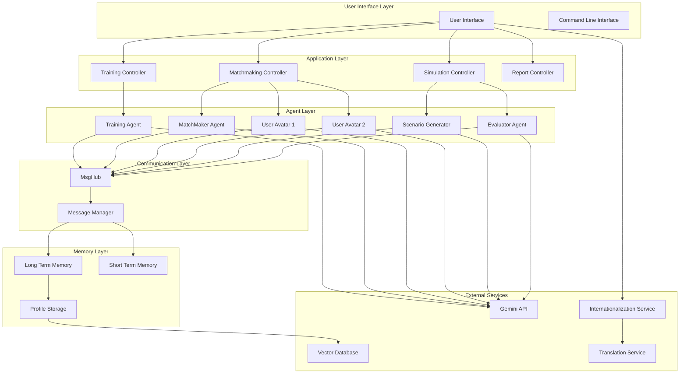

# Design Document: AI Matchmaker Application

## Overview

The AI Matchmaker application is a sophisticated multi-agent system built on the AgentScope framework that facilitates AI-powered matchmaking through three distinct phases: training, matchmaking, and simulation. The system creates digital avatars of users through conversational training, enables these avatars to interact for compatibility assessment, and simulates realistic marriage scenarios to evaluate long-term compatibility.

The application leverages Google's Gemini API for natural language processing, AgentScope's MsgHub for multi-agent orchestration, and Mem0/ReMe for persistent memory management. The system supports internationalization with multi-language capabilities to serve users globally. The design prioritizes authentic personality representation over artificial politeness to ensure realistic compatibility assessments.

## Architecture

### System Architecture Diagram



### Component Architecture

The system follows a layered architecture with clear separation of concerns:

1. **User Interface Layer**: Handles user interactions and displays results
2. **Application Layer**: Manages business logic and orchestrates workflows
3. **Agent Layer**: Contains specialized AI agents for different functions
4. **Communication Layer**: Manages message passing between agents
5. **Memory Layer**: Handles persistent and temporary data storage
6. **External Services**: Integrates with third-party APIs and databases

## Components and Interfaces

### Core Agent Classes

#### TrainingAgent
```python
class TrainingAgent(ReActAgent):
    """
    Specialized agent for conducting user personality interviews.
    Inherits from ReActAgent to support tool usage for memory recording.
    """
    
    def __init__(self, user_id: str, long_term_memory: LongTermMemory):
        # Configuration for interview-style interactions
        # Tool access for memory recording
        # Personality assessment question templates
    
    def conduct_interview(self) -> InterviewResult:
        # Progressive questioning strategy
        # Dynamic follow-up based on responses
        # Automatic memory recording of key insights
    
    def validate_profile_completeness(self) -> bool:
        # Check if sufficient personality data collected
        # Validate coverage of key personality dimensions
```

#### UserAvatar
```python
class UserAvatar(DialogAgent):
    """
    Digital representation of a user based on trained personality data.
    Retrieves and applies personality traits in conversations.
    """
    
    def __init__(self, user_id: str, personality_profile: PersonalityProfile):
        # Load personality data from long-term memory
        # Configure response style based on user traits
        # Set authenticity parameters
    
    def respond_authentically(self, message: Msg) -> Msg:
        # Retrieve relevant personality traits
        # Generate response consistent with user values
        # Avoid artificial politeness when conflicts arise
    
    def handle_conflict(self, scenario: Scenario) -> Response:
        # Express disagreement when values conflict
        # Maintain character consistency under pressure
```

#### MatchMakerAgent
```python
class MatchMakerAgent(DialogAgent):
    """
    Facilitates conversations between user avatars.
    Manages conversation flow and prevents infinite loops.
    """
    
    def __init__(self):
        # Conversation management templates
        # Topic progression strategies
        # Conflict resolution approaches
    
    def facilitate_introduction(self, avatar1: UserAvatar, avatar2: UserAvatar):
        # Guide initial introductions
        # Suggest conversation topics
        # Monitor interaction quality
    
    def manage_conversation_flow(self, max_turns: int = 20):
        # Enforce turn limits
        # Redirect stalled conversations
        # Summarize key compatibility points
```

#### ScenarioGenerator
```python
class ScenarioGenerator(ReActAgent):
    """
    Creates realistic marriage scenarios for compatibility testing.
    Adapts scenario difficulty based on user profiles.
    """
    
    def __init__(self, scenario_library: ScenarioLibrary):
        # Load predefined scenario templates
        # Configure difficulty scaling
        # Set contextual adaptation rules
    
    def generate_scenario(self, profiles: List[PersonalityProfile]) -> Scenario:
        # Select appropriate scenario type
        # Customize details for user contexts
        # Ensure realistic challenge level
    
    def create_financial_scenario(self) -> FinancialScenario:
        # Budget conflicts, major purchases, debt management
    
    def create_family_scenario(self) -> FamilyScenario:
        # In-law conflicts, parenting decisions, household roles
```

### Memory Management System

#### PersonalityProfile
```python
class PersonalityProfile:
    """
    Structured representation of user personality and preferences.
    """
    
    def __init__(self):
        self.values: Dict[str, float]  # Core values with strength ratings
        self.preferences: Dict[str, Any]  # Lifestyle preferences
        self.communication_style: CommunicationStyle
        self.conflict_resolution: ConflictStyle
        self.life_goals: List[LifeGoal]
        self.deal_breakers: List[str]
    
    def get_relevant_traits(self, context: str) -> Dict[str, Any]:
        # Retrieve personality aspects relevant to specific contexts
        # Support both keyword and semantic search
    
    def calculate_compatibility(self, other: 'PersonalityProfile') -> CompatibilityScore:
        # Compare values, preferences, and communication styles
        # Identify potential conflict areas
        # Generate compatibility metrics
```

#### LongTermMemoryManager
```python
class LongTermMemoryManager:
    """
    Manages persistent storage and retrieval of personality data.
    Integrates with Mem0 for advanced memory capabilities.
    """
    
    def __init__(self, vector_db_config: VectorDBConfig):
        # Initialize Mem0 connection
        # Configure embedding models
        # Set up hybrid search capabilities
    
    def store_personality_data(self, user_id: str, data: PersonalityData):
        # Structure and store personality information
        # Create semantic embeddings
        # Maintain data relationships
    
    def retrieve_contextual_memories(self, user_id: str, context: str) -> List[Memory]:
        # Hybrid search combining keywords and semantics
        # Rank results by relevance
        # Return structured memory objects
```

### Internationalization and Localization

#### LocalizationManager
```python
class LocalizationManager:
    """
    Manages multi-language support and cultural adaptation.
    Handles translation of agent prompts, UI text, and cultural context.
    """
    
    def __init__(self, supported_languages: List[str]):
        # Initialize translation services
        # Load cultural context databases
        # Configure language-specific personality models
    
    def translate_agent_prompt(self, prompt: str, target_language: str) -> str:
        # Translate system prompts while preserving meaning
        # Adapt cultural references and examples
        # Maintain personality assessment validity
    
    def adapt_scenarios_for_culture(self, scenario: Scenario, culture: str) -> Scenario:
        # Modify scenarios for cultural appropriateness
        # Adjust family dynamics and social expectations
        # Ensure realistic cultural context
    
    def get_localized_personality_questions(self, language: str) -> List[Question]:
        # Return culturally appropriate personality assessment questions
        # Maintain psychological validity across cultures
        # Adapt communication styles and examples

#### CulturalContextManager
```python
class CulturalContextManager:
    """
    Manages cultural adaptation of personality assessment and matching.
    Ensures compatibility evaluation considers cultural differences.
    """
    
    def __init__(self):
        # Load cultural dimension databases
        # Initialize cultural compatibility models
        # Set up cultural bias detection
    
    def adapt_personality_model(self, culture: str) -> PersonalityModel:
        # Adjust personality trait interpretations for culture
        # Modify value system weightings
        # Account for cultural communication styles
    
    def evaluate_cross_cultural_compatibility(self, profile1: PersonalityProfile, 
                                            profile2: PersonalityProfile) -> CrossCulturalScore:
        # Assess compatibility across cultural boundaries
        # Identify potential cultural conflict areas
        # Provide cultural adaptation recommendations
```

### Communication Infrastructure
```python
class MsgHubManager:
    """
    Manages multi-agent conversations using AgentScope's MsgHub.
    Handles message routing and conversation state.
    """
    
    async def create_matchmaking_session(self, participants: List[Agent]) -> MsgHub:
        # Initialize conversation environment
        # Set up message broadcasting
        # Configure participant permissions
    
    async def manage_conversation_flow(self, hub: MsgHub, max_duration: int):
        # Monitor conversation progress
        # Enforce time and turn limits
        # Handle agent disconnections
    
    def terminate_session(self, hub: MsgHub) -> ConversationSummary:
        # Clean up resources
        # Generate conversation summary
        # Extract key interaction points
```

## Data Models

### Core Data Structures

#### User Profile Schema
```python
@dataclass
class UserProfile:
    user_id: str
    basic_info: BasicInfo
    personality_traits: PersonalityTraits
    preferences: UserPreferences
    training_status: TrainingStatus
    language: str  # Primary language
    culture: str   # Cultural background
    created_at: datetime
    updated_at: datetime

@dataclass
class PersonalityTraits:
    openness: float  # 0.0 to 1.0
    conscientiousness: float
    extraversion: float
    agreeableness: float
    neuroticism: float
    values: Dict[str, float]  # Custom values with importance ratings
    communication_style: str
    conflict_resolution_style: str

@dataclass
class UserPreferences:
    age_range: Tuple[int, int]
    location_preferences: List[str]
    lifestyle_preferences: Dict[str, Any]
    deal_breakers: List[str]
    relationship_goals: List[str]
```

#### Conversation Data Schema
```python
@dataclass
class ConversationSession:
    session_id: str
    participants: List[str]  # User IDs
    session_type: SessionType  # TRAINING, MATCHMAKING, SIMULATION
    messages: List[Message]
    start_time: datetime
    end_time: Optional[datetime]
    status: SessionStatus

@dataclass
class Message:
    message_id: str
    sender_id: str
    sender_type: AgentType
    content: str
    timestamp: datetime
    metadata: Dict[str, Any]

@dataclass
class CompatibilityReport:
    session_id: str
    user_ids: Tuple[str, str]
    overall_score: float
    dimension_scores: Dict[str, float]
    interaction_analysis: InteractionAnalysis
    scenario_results: List[ScenarioResult]
    recommendations: List[str]
    generated_at: datetime
```

#### Scenario Data Schema
```python
@dataclass
class Scenario:
    scenario_id: str
    category: ScenarioCategory
    title: str
    description: str
    context: Dict[str, Any]
    difficulty_level: int
    expected_duration: int
    success_criteria: List[str]

@dataclass
class ScenarioResult:
    scenario_id: str
    participants: List[str]
    responses: List[Response]
    collaboration_score: float
    conflict_resolution_score: float
    value_alignment_score: float
    notes: str
```

### Database Schema Design

The system uses a hybrid approach combining relational data for structured information and vector storage for semantic search:

#### Relational Tables
- **users**: Basic user information and authentication
- **profiles**: Structured personality and preference data
- **sessions**: Conversation session metadata
- **scenarios**: Scenario definitions and templates
- **reports**: Generated compatibility assessments

#### Vector Storage
- **personality_embeddings**: Semantic representations of personality traits
- **conversation_embeddings**: Semantic representations of conversation content
- **scenario_embeddings**: Semantic representations of scenario responses

## Error Handling

### Agent Error Management

#### Communication Failures
```python
class AgentCommunicationError(Exception):
    """Raised when agents fail to communicate properly"""
    
    def __init__(self, agent_id: str, error_type: str, details: str):
        self.agent_id = agent_id
        self.error_type = error_type
        self.details = details
        super().__init__(f"Agent {agent_id} communication error: {error_type}")

class ConversationTimeoutError(Exception):
    """Raised when conversations exceed maximum duration"""
    
    def __init__(self, session_id: str, duration: int, max_duration: int):
        self.session_id = session_id
        self.duration = duration
        self.max_duration = max_duration
        super().__init__(f"Session {session_id} timed out after {duration}s (max: {max_duration}s)")
```

#### Memory System Errors
```python
class MemoryRetrievalError(Exception):
    """Raised when memory retrieval fails"""
    
    def __init__(self, user_id: str, query: str, error_details: str):
        self.user_id = user_id
        self.query = query
        self.error_details = error_details
        super().__init__(f"Memory retrieval failed for user {user_id}: {error_details}")

class ProfileIncompleteError(Exception):
    """Raised when user profile lacks sufficient data"""
    
    def __init__(self, user_id: str, missing_components: List[str]):
        self.user_id = user_id
        self.missing_components = missing_components
        super().__init__(f"Profile incomplete for user {user_id}: missing {missing_components}")
```

### Error Recovery Strategies

#### Graceful Degradation
- **Partial Profile Matching**: Continue with available data when some personality aspects are missing
- **Simplified Scenarios**: Fall back to basic scenarios when complex generation fails
- **Manual Intervention Points**: Allow human moderators to step in when agents get stuck

#### Retry Mechanisms
- **Exponential Backoff**: For API failures and temporary service unavailability
- **Circuit Breaker Pattern**: Prevent cascade failures in multi-agent interactions
- **Fallback Responses**: Pre-defined responses when AI generation fails

#### Monitoring and Alerting
- **Agent Health Checks**: Regular monitoring of agent responsiveness and coherence
- **Conversation Quality Metrics**: Automated detection of poor interaction quality
- **Performance Thresholds**: Alerts when response times or success rates degrade

## Testing Strategy

### Dual Testing Approach

The testing strategy combines unit tests for specific functionality with property-based tests for universal correctness properties. This comprehensive approach ensures both concrete behavior validation and broad input coverage.

#### Unit Testing Focus Areas
- **Agent Initialization**: Verify proper configuration and setup
- **Memory Operations**: Test storage and retrieval of personality data
- **Message Handling**: Validate message parsing and routing
- **Error Conditions**: Test exception handling and recovery
- **Integration Points**: Verify component interactions

#### Property-Based Testing Configuration

The system uses **Hypothesis** for Python property-based testing with the following configuration:
- **Minimum 100 iterations** per property test to ensure comprehensive coverage
- **Custom generators** for personality profiles, conversation scenarios, and user interactions
- **Shrinking strategies** to find minimal failing examples when tests fail

Each property test must include a comment tag referencing the design document property:
```python
# Feature: ai-matchmaker, Property 1: Training completeness validation
```

### Testing Framework Integration

#### Test Structure
```python
# Unit Tests
tests/
├── unit/
│   ├── test_agents.py
│   ├── test_memory.py
│   ├── test_scenarios.py
│   └── test_communication.py
├── integration/
│   ├── test_training_flow.py
│   ├── test_matchmaking_flow.py
│   └── test_simulation_flow.py
└── property/
    ├── test_personality_properties.py
    ├── test_conversation_properties.py
    └── test_compatibility_properties.py
```

#### Mock and Test Data Strategy
- **Personality Generators**: Create diverse, realistic personality profiles for testing
- **Conversation Simulators**: Generate varied conversation patterns and styles
- **Scenario Libraries**: Maintain test scenarios covering edge cases and typical situations
- **API Mocking**: Mock external services (Gemini API, Vector DB) for isolated testing

## Correctness Properties

*A property is a characteristic or behavior that should hold true across all valid executions of a system—essentially, a formal statement about what the system should do. Properties serve as the bridge between human-readable specifications and machine-verifiable correctness guarantees.*

Based on the prework analysis and property reflection, the following correctness properties ensure the AI Matchmaker system operates reliably across all scenarios:

### Property 1: Memory Round-Trip Consistency
*For any* personality data collected during training, storing it in long-term memory and then retrieving it should return equivalent information that accurately represents the original user input.
**Validates: Requirements 1.2, 1.3, 4.1, 4.2**

### Property 2: Agent Response Authenticity
*For any* conversation scenario and user personality profile, agent responses should consistently reflect the stored personality traits rather than generic politeness, even when conflicts arise.
**Validates: Requirements 2.4, 3.2, 3.4, 6.1, 6.2, 6.3, 6.4**

### Property 3: Conversation Flow Management
*For any* multi-agent conversation, the system should manage turn-taking, prevent infinite loops, and enforce conversation limits while maintaining natural interaction flow.
**Validates: Requirements 5.1, 5.2, 5.4**

### Property 4: Memory Retrieval Relevance
*For any* memory query with contextual information, the system should return personality traits that are semantically and contextually relevant to the query using both keyword and semantic search.
**Validates: Requirements 4.2, 4.3, 4.4**

### Property 5: Scenario Contextual Appropriateness
*For any* user profile combination, generated scenarios should be contextually appropriate for the users' backgrounds and provide sufficient context for meaningful agent responses.
**Validates: Requirements 3.1, 7.2, 7.4**

### Property 6: Data Persistence Across Sessions
*For any* user profile data, information stored in one session should remain accessible and unchanged in subsequent sessions, maintaining consistency across the user's entire interaction history.
**Validates: Requirements 4.5**

### Property 7: Compatibility Assessment Comprehensiveness
*For any* completed matchmaking and simulation session, the compatibility assessment should analyze all required dimensions (communication patterns, conflict resolution, value alignment, collaboration) and provide specific supporting examples.
**Validates: Requirements 8.2, 8.3, 8.4, 8.5**

### Property 8: Conflict Recording and Analysis
*For any* personality conflict that occurs during agent interactions, the system should accurately record the conflict details and incorporate them as meaningful data points in compatibility scoring.
**Validates: Requirements 6.5**

### Property 9: Scenario Difficulty Variation
*For any* sequence of simulation sessions, scenario difficulty and emotional intensity should vary appropriately to provide comprehensive compatibility testing without overwhelming users.
**Validates: Requirements 7.5**

### Property 10: Profile Completeness Validation
*For any* user profile, the training completion validation should accurately assess whether sufficient personality data has been collected across all required dimensions (personality, values, lifestyle, preferences).
**Validates: Requirements 1.5**

### Property 11: Cross-Cultural Translation Consistency
*For any* agent prompt or user interface text, translation to different languages should preserve the original meaning and cultural appropriateness while maintaining the psychological validity of personality assessments.
**Validates: Requirements 9.1, 9.2, 9.3**

### Property 12: Cultural Context Adaptation
*For any* scenario generation or compatibility assessment involving users from different cultural backgrounds, the system should appropriately adapt content and evaluation criteria to account for cultural differences while maintaining fairness.
**Validates: Requirements 9.4, 9.5, 9.6**